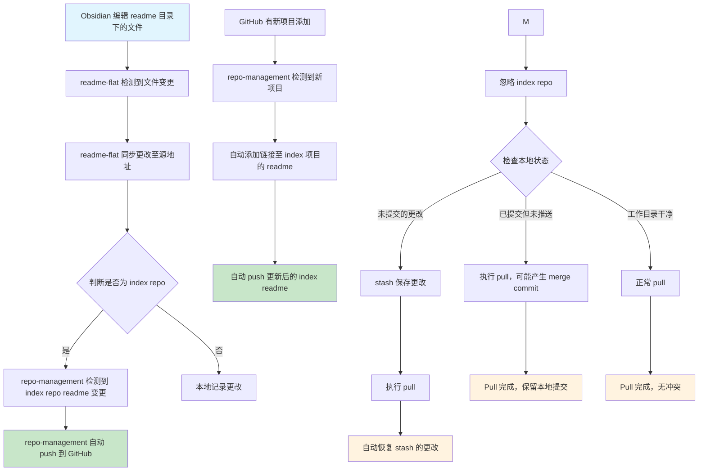

# Default Projects

Default projects
## Project List

对当前的项目进行了重构测试重构的效果

我感觉需要有一个结构图串联我的项目

### GitHub 管理
- `readme-flat`: 本地双向同步 obsidian, 支持双向同步 markdown reeadme 的编辑, 保留自定义 readme 文件的层级结构
- `repo-management`: 一旦有新项目添加至 GitHub, 自动添加链接至 index 项目的 readme, 一旦repo index 的 readme 有变更, 自动push

**整体流程**
Obsidian 对[readme]目录下的文件进行编辑 -> `readme-flat` 同步更改至源地址 -> 如果是 `index repo markdown` -> `repo-management` 自动push
       -> 如果是其他项目 repo -> 本地记录更改

（移除 auto-match-pull 相关联动）
1. 未提交的更改: 会被stash保存，pull后自动恢复
2. 已提交但未推送: 不会丢失，可能产生merge commit
3. 工作目录干净: 正常pull，无影响

<!-- 自动生成的项目列表将在此处更新 -->

---

*This file is automatically maintained by the repo-management system.*

<!-- AUTO-GENERATED-CONTENT:START -->
- **[readwise-inbox](https://github.com/APE-147/readwise-inbox)**
  - 创建时间: 2025-10-07
- **[reminder_sync](https://github.com/APE-147/reminder_sync)**
  - 创建时间: 2025-10-04
- **[notion_sync](https://github.com/APE-147/notion_sync)**
  - 创建时间: 2025-10-04
- **[obsidian_sync](https://github.com/APE-147/obsidian_sync)**
  - 创建时间: 2025-10-04
- **[todo-event-database](https://github.com/APE-147/todo-event-database)**
  - 创建时间: 2025-10-02
- **[agent-cli](https://github.com/APE-147/agent-cli)**
  - 创建时间: 2025-10-02
- **[Test](https://github.com/APE-147/Test)**
  - 创建时间: 2025-10-02
- **[readwise-sync](https://github.com/APE-147/readwise-sync)**
  - 创建时间: 2025-10-01
- **[openvpn-cross](https://github.com/APE-147/openvpn-cross)**
  - 创建时间: 2025-09-29
- **[yolo](https://github.com/APE-147/yolo)**
  - 创建时间: 2025-09-27
- **[singlefile-archiver](https://github.com/APE-147/singlefile-archiver)** - A Python tool for automated SingleFile web archiving with Docker integration and CLI interface
  - 创建时间: 2025-09-20
- **[video-downloader](https://github.com/APE-147/video-downloader)**
  - 创建时间: 2025-09-20
- **[rss-inbox](https://github.com/APE-147/rss-inbox)**
  - 创建时间: 2025-09-20
- **[weread2notion](https://github.com/APE-147/weread2notion)** - 将微信读书划线同步到Notion
  - 创建时间: 2025-09-18
- **[timing-entries-sync](https://github.com/APE-147/timing-entries-sync)** - A modern Python CLI tool for synchronizing Timing app entries with Google Calendar
  - 创建时间: 2025-08-23
- **[auto-match-pull](https://github.com/APE-147/auto-match-pull)**
  - 创建时间: 2025-07-10
- **[obsidian-tab-switch](https://github.com/APE-147/obsidian-tab-switch)**
  - 创建时间: 2025-07-12
- **[repo-management](https://github.com/APE-147/repo-management)**
  - 创建时间: 2025-07-10
- **[readme-flat](https://github.com/APE-147/readme-flat)**
  - 创建时间: 2025-07-10
<!-- AUTO-GENERATED-CONTENT:END -->
